## Инструмент ipcalc(Part 1)
1. Сети и маски
- Я использовал утилиту `ipcalc` для получения адреса сети `192.167.38.54/13`.
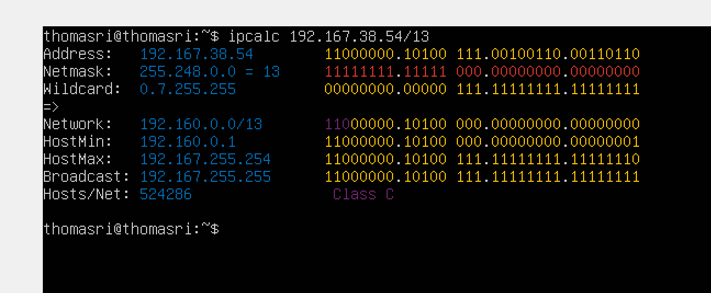
<figcaption>Адрес сети- 192.160.0.0/13.</figcaption>

- Я перевел маски `255.255.255.0` в префиксную и двоичную запись, `/15` в обычную и двоичную, `11111111.11111111.11111111.11110000` в обычную и префиксную.
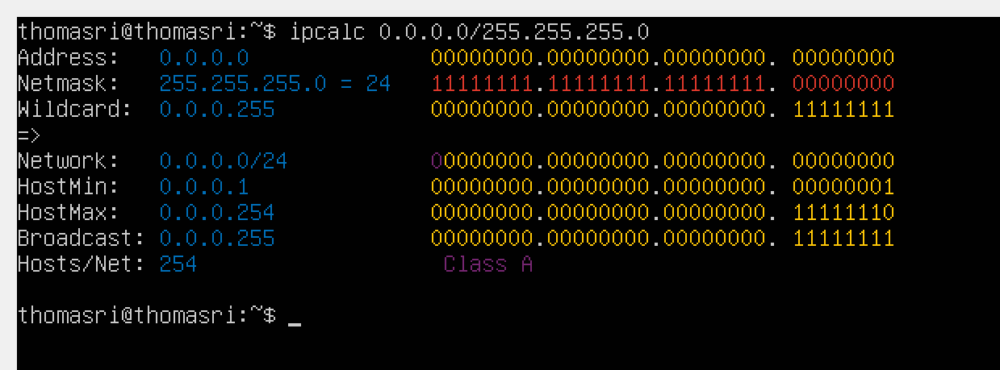
<figcaption>Маска 255.255.255.0, двоичная запись- 11111111.11111111.11111111.00000000, префиксная(CIDR) запись- 24(т.е. первые 24 бита установлены 1).</figcaption>

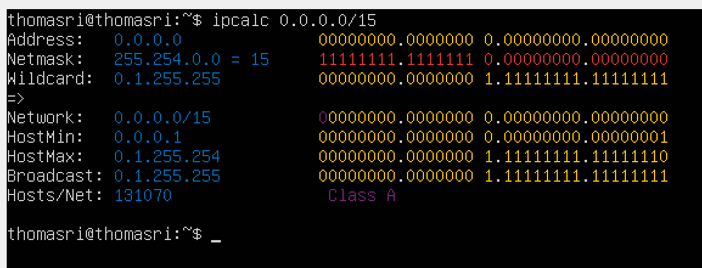
<figcaption>Маска /15, двоичная запись- 11111111.11111110.00000000.00000000, обычная запись-255.254.0.0.</figcaption>

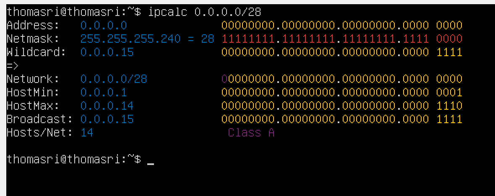
<figcaption>Маска 11111111.11111111.11111111.11110000, префиксная запись- 28, обычная запись-255.255.255.240.</figcaption>

- Я указал минимальный и максимальный хост в сети `12.167.38.4` при масках: `/8`, `11111111.11111111.00000000.00000000`, `255.255.254.0` и `/4`
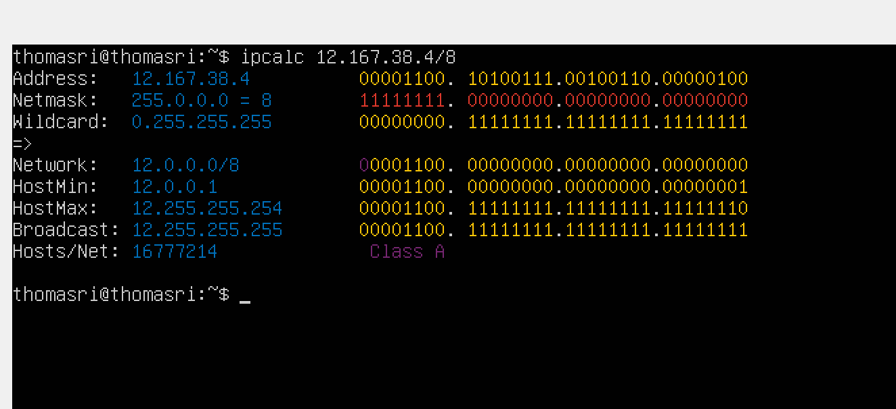
<figcaption>Маска /8, минимальный хост-12.0.0.1, максимальный хост-12.255.255.254.</figcaption>

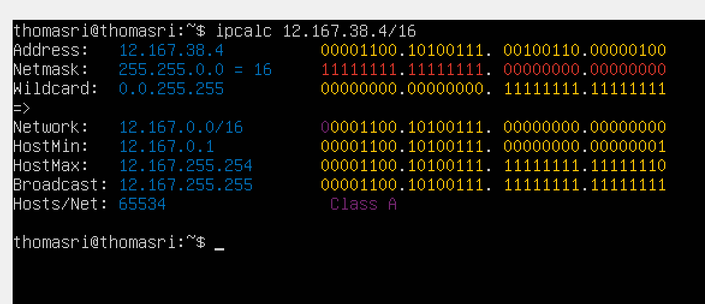
<figcaption>Маска 11111111.11111111.00000000.00000000, минимальный хост-12.167.0.1, максимальный хост-12.167.255.254.</figcaption>

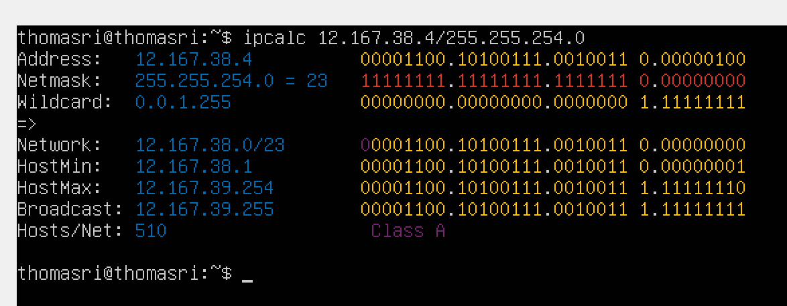
<figcaption>Маска 255.255.254.0, минимальный хост-12.167.38.1, максимальный хост-12.167.39.254.</figcaption>

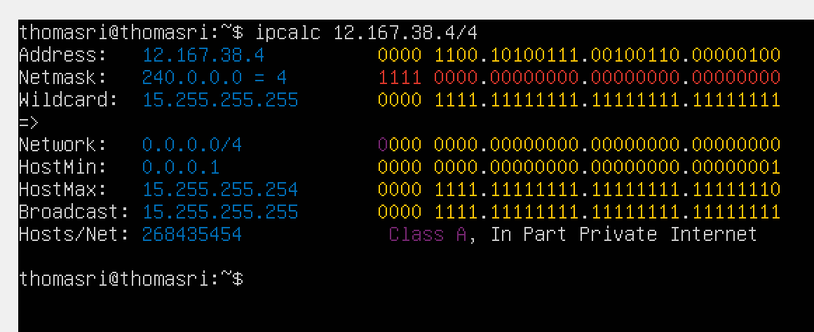
<figcaption>Маска /4, минимальный хост-0.0.0.1, максимальный хост-15.255.255.254.</figcaption>

2. localhost
Из данного списка приложений, получилось подключиться к двум: `127.0.0.2` и `127.1.0.1`.
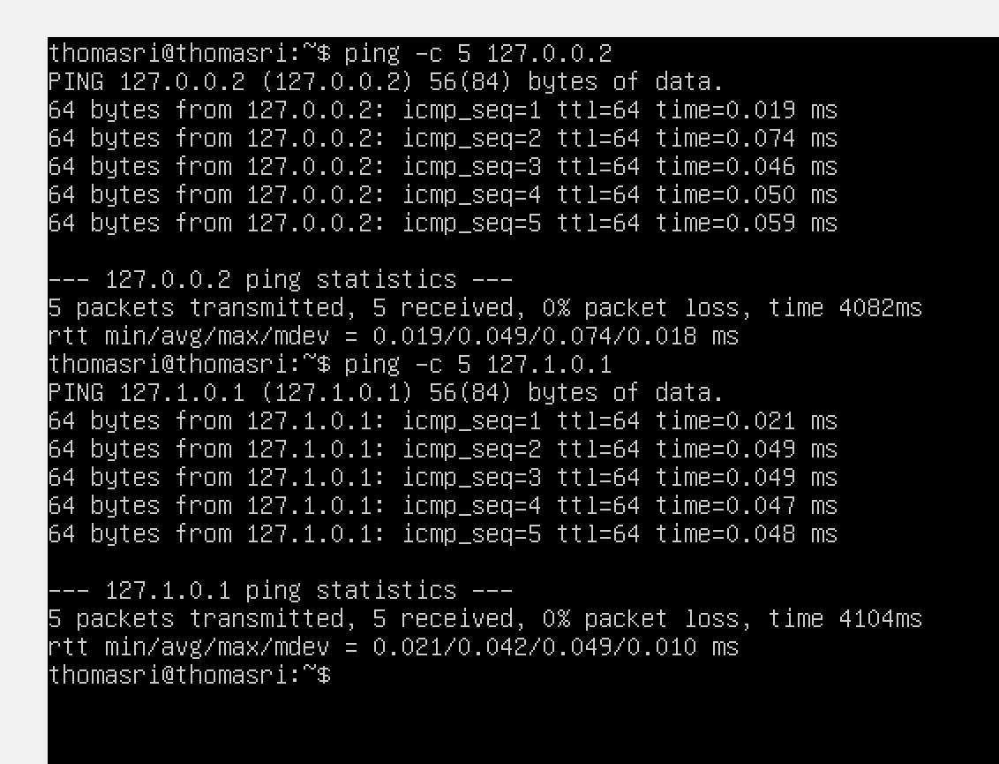
<figcaption>Пропинговал localhost 127.0.0.2 и 127.1.0.1. Также можно было бы избежать данного этапа, т.к. весь диапазон 127.0.0.0/8 зарезервирован для loopback-интерфейса, что мы как раз и ищем.</figcaption>

3. Диапазоны и сегменты сетей
- По стандарту `RFC 1918` (это документ, выпущенный организацией `IETF (Internet Engineering Task Force)`, который определяет диапазоны IP-адресов, зарезервированные для использования в частных сетях.), к частным адресам относятся адреса из диапазона: `10.0.0.0/8`(от `10.0.0.0` до `10.255.255.255`), `172.16.0.0/12`(от `172.16.0.0` до `172.31.255.255`), `192.168.0.0/16` (от `192.168.0.0` до `192.168.255.255`).
Также loopback-адреса не используются в качестве публичных: диапазон `127.0.0.0/8` (от `127.0.0.0` до `127.255.255.255`).
Из перечисленных IP можно использовать в качестве публичного: `134.43.0.2`, `172.0.2.1`, `192.172.0.1`, `172.68.0.2`, `192.169.168.1`.
В качестве частного: `10.0.0.45`, `192.168.4.2`,  `172.20.250.4`, `172.16.255.255`, `10.10.10.10`.

- IP-адрес шлюза — это адрес устройства, которое служит "выходом" из локальной сети в другие сети.
Из перечисленных IP-адресов шлюзом у сети `10.10.0.0/18` (от `10.10.0.0` до `10.10.63.255`) могут быть:`10.10.0.2`, `10.10.10.10`, `10.10.1.255`.
Условия подбора: адрес входит в диапазон сети, адрес не является сетевым (первый адрес в диапазоне), адрес не является широковещательным(последний адрес в диапазоне).

## Статическая маршрутизация между двумя машинами(Part 2)
1. С помощью команды `ip a` посмотрел существующие сетевые интерфейсы на машинах `ws1` и `ws2`.
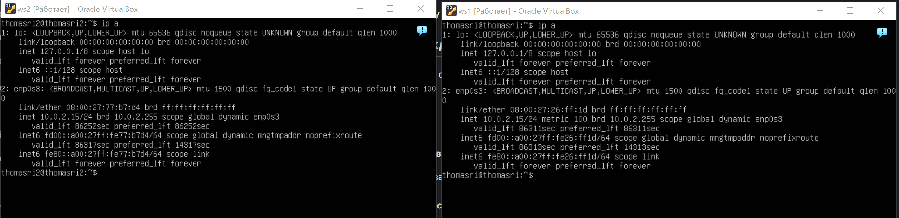
<figcaption>Вызов и вывод команд.</figcaption>

Обе машины имеют одинаковый сетевой интерфейс по умолчанию: `10.0.2.15/24`. Это происходит из-за типа подключения `NAT`.
Изменил файл `etc/netplan/00-installer-config.yaml` для каждой машины.
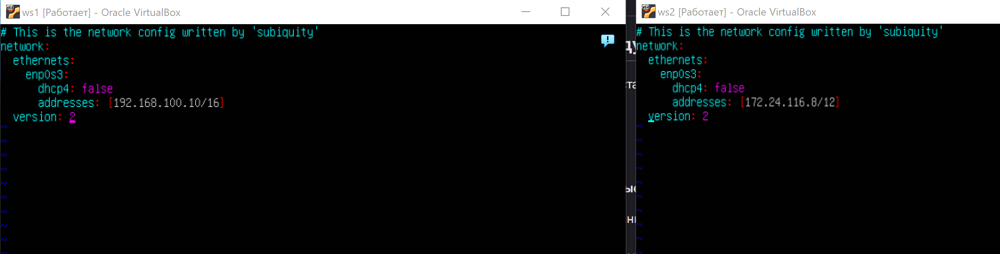
<figcaption>Изменил etc/netplan/00-installer-config.yaml для ws1-  192.168.100.10/16, для ws2- 172.24.116.8/12.</figcaption>

Выполнил команду `sudo netplan apply` для перезапуска сервиса сети.

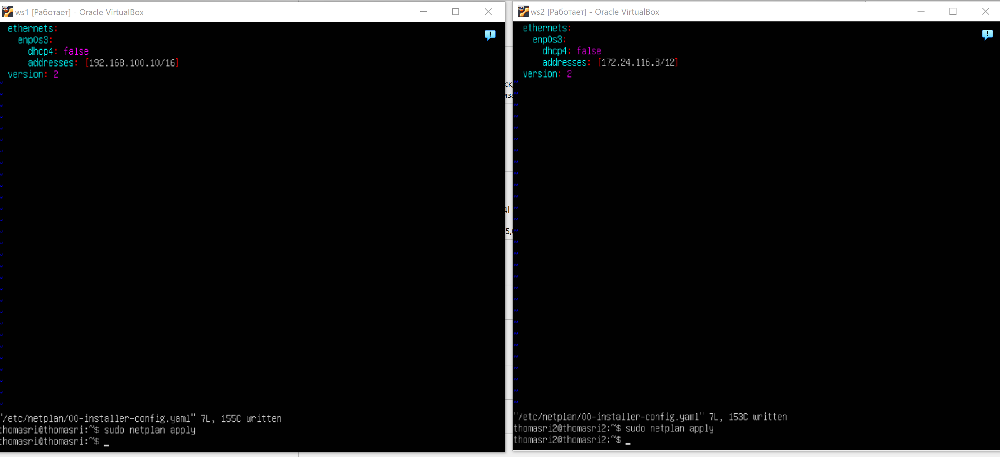
<figcaption>Вызов команды.</figcaption>

2. Добавление статического маршрута вручную
Т.к. обе машины имеют тип подключения `NAT`, машины не могут напрямую обмениваться пакетами , для этого необходим шлюз. А для этого необходимо еще одно устройство в сети. Я сменил тип подключения на машинах на `Host-Only Network (Внутренняя сеть)`. Для решения данной задачи с использованием двух машин данный вариант подходит. Также при вызове команды шлюз `via` не требуется, т.к. все устройства находятся в одной сети, поэтому маршрутизация через шлюз не требуется.
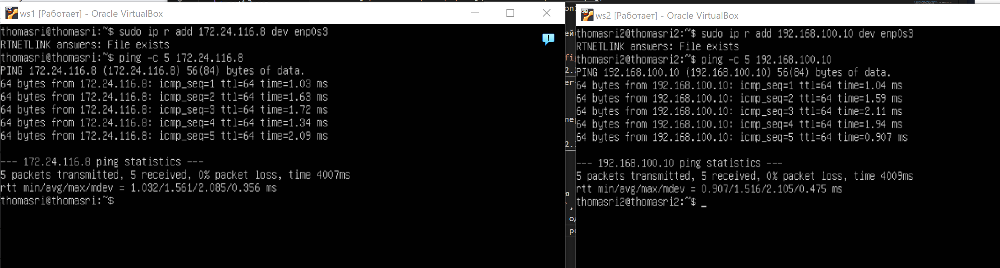
<figcaption>Вызов команд.</figcaption>

3.  Добавление статического маршрута с сохранением
Перезапустил машины через команду `sudo reboot`.

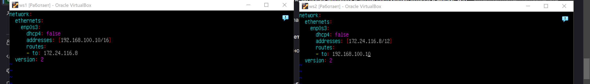
<figcaption>Добавил в файле etc/netplan/00-installer-config.yaml, куда должен направляться трафик.</figcaption>

Выполнил команду `sudo netplan apply` для перезапуска сервиса сети.

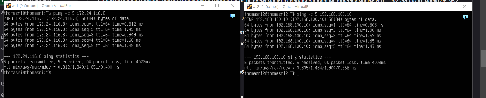
<figcaption>Пропинговал соединения между машинами.</figcaption>

## Утилита iperf3(Part 3)
1. Скорость соединения
`Mbps`- мегабит в секунду.
`MB\s`- мегабайт в секунду.
`Kbps`- килобиты в секунду.
`Gbps`- гигабит в секунду.
Использовал десятичную, а не двоичную систему, т.к. это скорость соединения.
`8 Mbps = 1 MB\s` (8/8). Перевожу мегабиты/сек в мегабайты/сек.
`100 MB\s = 800000 Kbps` (100*8*1000). Перевожу мегабайты/сек в мегабиты/сек, перевожу мегабиты/сек в килобиты/сек.
`1 Gbps = 1000 Mbps` (1*1000). Перевожу гигабиты/сек в мегабиты/сек.

2. Утилита iperf3
На `ws1` запускаю `iperf3` в режиме сервера через команду `iperf3 -s`. На `ws2` запускаю `iperf3` в режиме клиента через команду `iperf3 -c 192.168.100.10`, подключаюсь к порту по умолчанию, т.к. не менял его на `ws1`.
В выводе сервера видно: с какого адреса подключился клиент и порт его машины, идентификатор потока(по умолчанию 5), интервал времени тестирования, объем данных,переданный за указанный период, скорость передачи, `sender` (данные, отправленные клиентом на сервер), `receiver` (данные, полученные клиентом от сервера).
В выводе клиента видно: адрес сервера и порт, идентификатор потока(по умолчанию 5), интервал времени тестирования, объем данных,переданный за указанный период, скорость передачи, количество ретрансмиссий, `cwnd`(сколько данных может быть отправлено без подтверждения), `sender` (данные, отправленные клиентом на сервер), `receiver` (данные, полученные клиентом от сервера).

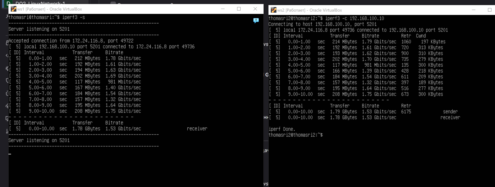
<figcaption>Вывод сервер и клиента. Скорость соединения- 1.53 Gbits/sec(чуть больше 191 мегабайта в секунду).</figcaption>

## Сетевой экран(Part 4)
1. Утилита iptables
`#!/bin/sh`- указывает на использование интерпретатора `sh` для выполнения скрипта
`iptables -F`- очищает инструкции для управления сетевым трафиком в таблице `filter`(основная таблица для фильтрации сетевого трафика, выбирается по умолчанию).
`iptables -X`- очищает пользовательские цепочки, которые используются для комбинации правил.
`iptables -A INPUT -p tcp --dport 22 -j ACCEPT`-  добавляет правило в конец цепочки `INPUT`,отвечающую за входящий трафик. Указывает, что это правило применяется только к `TCP-трафику`. Указывает порт `22` для `SSH`. Принимает пакет, если он соответствует правилу.
`iptables -A INPUT -p tcp --dport 80 -j ACCEPT`- схожее правило, только для порта `80`, используется для протокола `HTTP` (HyperText Transfer Protocol). Необходимо для передачи веб-страниц и других данных между веб-сервером и браузером.
`iptables -A OUTPUT -p icmp --icmp-type echo-reply -j DROP`- добавляет правило в конец цепочки `OUTPUT`, отвечающую за исходящий трафик. Указывает, что это правило применяется только к `ICMP-трафику`(трафик для диагностики сети). Указывает тип `ICMP-пакета`. И указывает, что пакет `echo-reply` в ответ на `echo-request` будет отброшен без уведомления отправителя, т.е. при попытке пропинговать машину, она не ответит.
`iptables -A OUTPUT -p icmp --icmp-type echo-reply -j ACCEPT`- схожее правило, но оно разрешает отправку пакетов в ответ на `echo-request`.

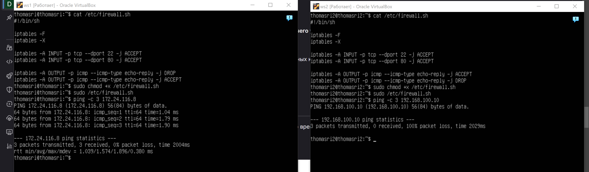
<figcaption>Созданные файлы, запуск этих файлов и попытка пропинговать. Видно, что не пингуется 1 машина,где сначала идет запрещающее правило, а в конце разрешающее правило. Правила проверяются по цепочке сверху вниз, как только пакет соответствует какому-либо правило, оно выполняется и дальнейшие правила не проверяются.</figcaption>

2. Утилита nmap
Через команду `nmap IP-адрес` просканировал сеть, видно, что хосты машин запущены `Host is up`.
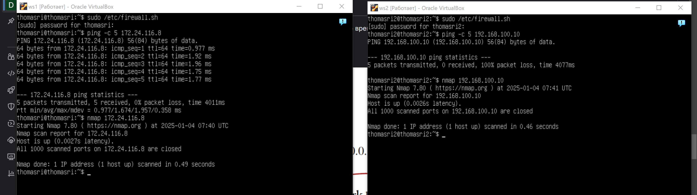
<figcaption>Пропинговал сеть и использовал nmap.</figcaption>

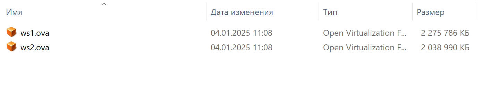
<figcaption>Сделал дампы образов виртуальных машин.</figcaption>

## Статическая маршрутизация сети(Part 5)
1. Настройка адресов машин
- Поднял 3 рабочие станции (`ws11`, `ws21`, `ws22`) и 2 роутера (`r1`, `r2`).
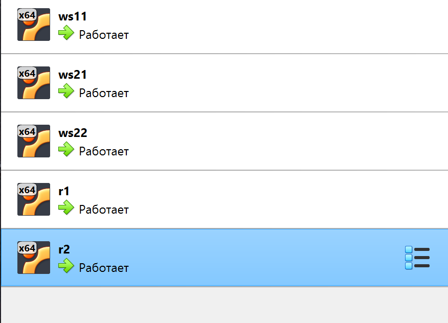
<figcaption>Поднятые машины.</figcaption>

- 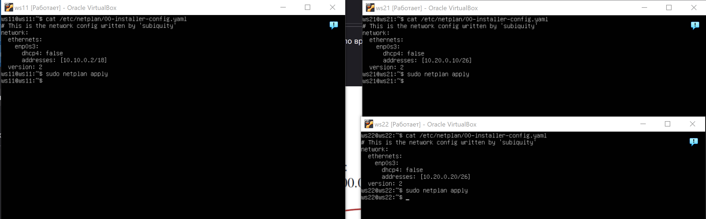
<figcaption>Содержанием файла etc/netplan/00-installer-config.yaml для машин ws11, ws21, ws22 и перезапуск сети.</figcaption>

- 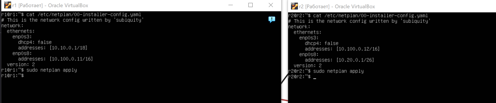
<figcaption>Содержанием файла etc/netplan/00-installer-config.yaml для машин r1, r2 и перезапуск сети.</figcaption>

Командой `ip -4 a` посмотрел IPv4-адрес, и проверил, что он задан верно.
- 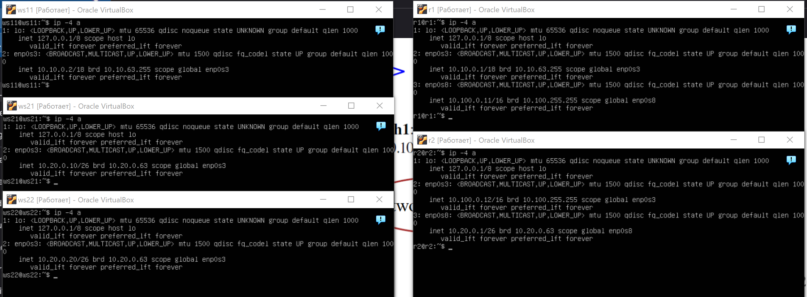
<figcaption>Выполнение команды на каждой машине.</figcaption>

- 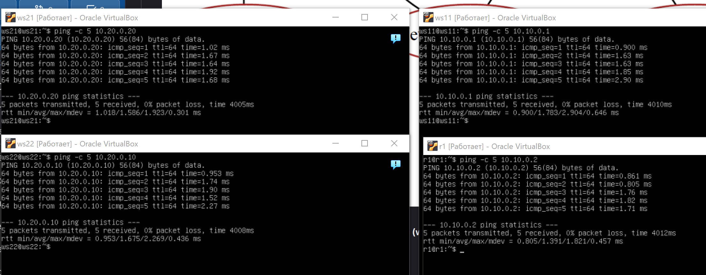
<figcaption>Пропинговал ws22 с ws21. Также r1 с ws11.</figcaption>

В машинах я не менял названия интерфейсов `enp*s*` на `eth*`, т.к. это не несет практической пользы.

2. Включение переадресации IP-адресов
- С помощью команды `sysctl -w net.ipv4.ip_forward=1`  изменил значение параметра ядра, которое управляет переадресацией `IPv4-пакетов`, на 1. Т.е. включил на машинах `r1` и `r2` переадресацию. Теперь машина принимает пакет на одном интерфейсе, проверяет таблицу маршрутизации, чтобы определить, куда отправить пакет. И если пакет предназначен для другой сети, машина пересылает его. Но данный способ работает только до перезагрузки.
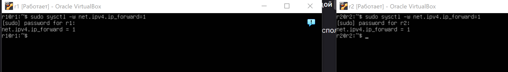
<figcaption>Вызов команд.</figcaption>

- В файле `/etc/sysctl.conf` разкоментил строку `net.ipv4.ip_forward = 1`. Теперь `IP-переадресация` включена на постоянной основе.
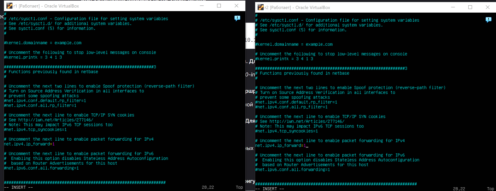
<figcaption>Измененный файл.</figcaption>

- Перезапустил машины и проверил состояние переадресации.
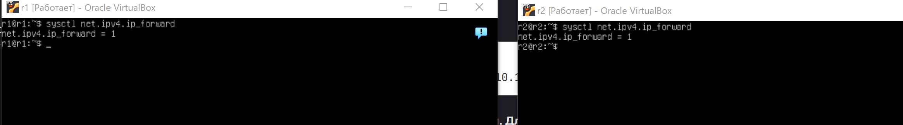
<figcaption>Получил вывод 1, т.е. переадресация включена.</figcaption>

3.  Установка маршрута по умолчанию
- Изменил файлы `etc/netplan/00-installer-config.yaml`, добавив в них строку `gateway4`- `IP-адрес` шлюза по умолчанию. После этого принял изменения и через команду `ip r` просмотрел таблицу маршрутизации, видно что в таблице есть строка с маршрутом по умолчанию.

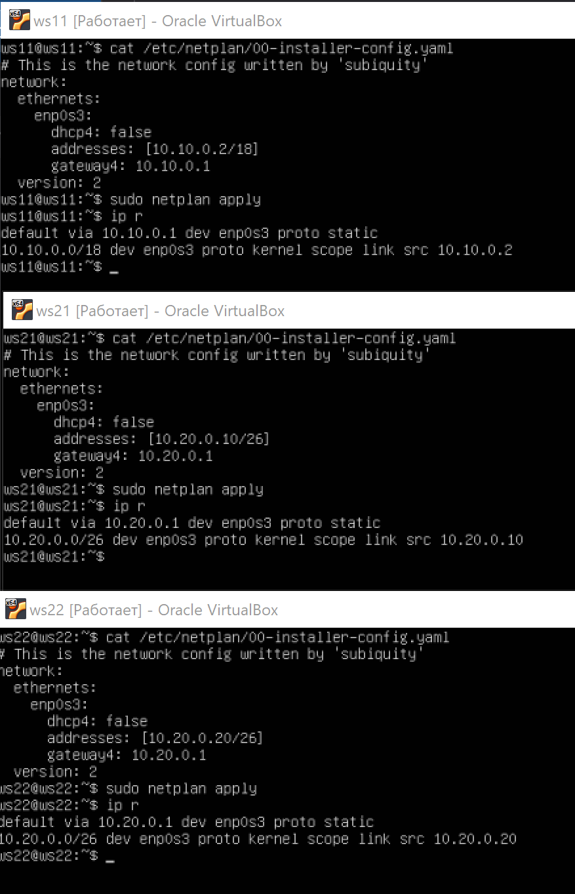
<figcaption>Измененный файлы и вызов ip r.</figcaption>

- Пропинговал с `ws11` роутер `r2` с использование `tcpdump` (с упрощенным выводом, без преобразования `IP-адреса` в имена хостов, захватывал трафик на интерфейсе `enp0s3`).

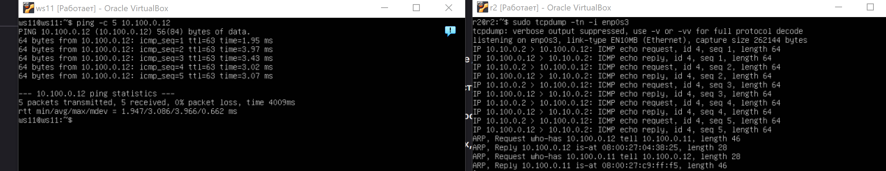
<figcaption>Видно запись echo request, значит пинг доходит до r2.</figcaption>

4. Добавление статических маршрутов
- Для r1 добавил строчки после интефейса `enp0s8`:
`routes:`
`to: 10.20.0.0/26`
`via: 10.100.0.12`
Т.е. если машина получает пакеты, которые нобходимо доставить в сеть `10.20.0.0/26`, пакеты передаются через интерфейс `enp0s8` до машины `10.100.0.12`, которая передает их в сеть `10.20.0.0/26`.

- Для r2 добавил строчки после интефейса `enp0s3`:
`routes:`
`to: 10.10.0.0/18`
`via: 10.100.0.11`
Т.е. если машина получает пакеты, которые нобходимо доставить в сеть `10.10.0.0/18`, пакеты передаются через интерфейс `enp0s3` до машины `10.100.0.11`, которая передает их в сеть `10.10.0.0/18`.

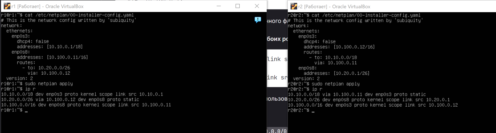
<figcaption>Измененный файлы  etc/netplan/00-installer-config.yaml для r1 и r2, обновление настроек сети а также вызов ip r.</figcaption>

- На ws11 выполнил команды `ip r list 10.10.0.0/18` и `ip r list 0.0.0.0/0`. Сначала просмотрел маршруты из таблицы маршрутизации, которые относятся к сети `10.10.0.0/18`, после этого просмотрел маршрут по умолчанию если для целевой сети нет явного маршрута.

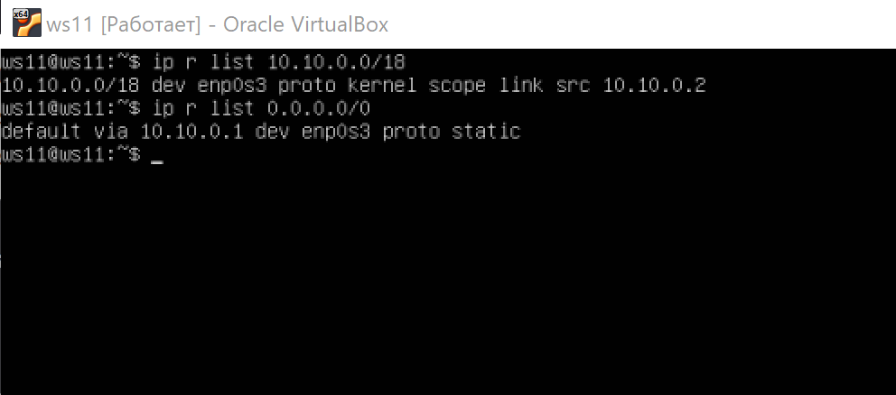
<figcaption>Для адреса 10.10.0.0/18 был вбыран маршрут, отличающийся от маршрута по умолчанию, потому что таблица маршрутизации имеет специфику работы. Она выбирает маршрут, который имеет наибольшую маску, т.е. является наиболее специфичным.</figcaption>

5. Построение списка маршрутизаторов
- На `r1` запустил `tcpdump -tnv -i enp0s3`, т.е. теперь я захватываю трафик на r1, на сетевом интерфейсе enp0s3 и вывожу информацию  о каждом пакете без временных меток, не преобразую IP-адреса в доменные имена и добавляя подробную информацию о каждом пакете.

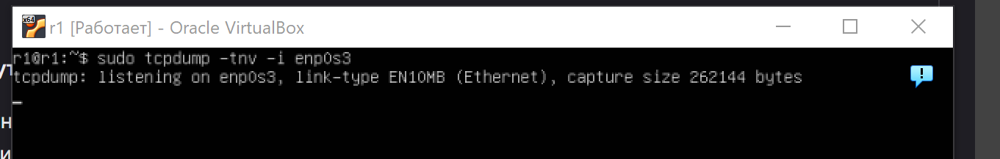
<figcaption>Начало захвата сетевых пакетов.</figcaption>

-  С помощью `traceroute` построил список маршрутизаторов на пути от `ws11` до `ws21`, использовал команду `traceroute 10.20.0.20`.
Вывод показал, что пакеты проходят через три узла:
`10.10.0.1` — первый шлюз, это интерфейс `enp0s3` маршрутизатора `r1`.
`10.100.0.12` — второй маршрутизатор, это интерфейс enp0s3 маршрутизатора `r2`.
`10.20.0.20` — целевая машина `ws21`.

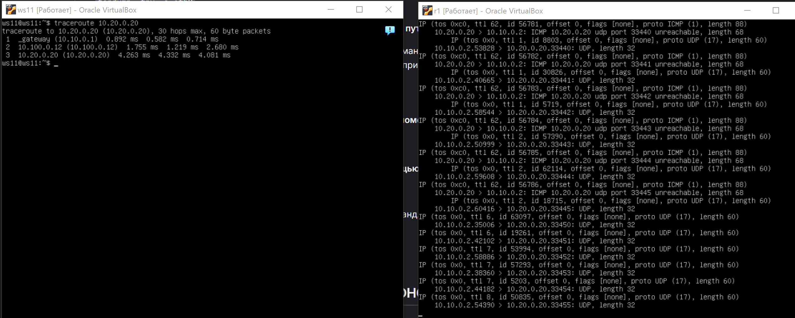
<figcaption>Выполнение команд.</figcaption>

Принцип работы `traceroute` основан на использовании  `TTL (Time to Live)` в IP-пакетах и ICMP-сообщений о превышении `TTL`. `TTL` указывает количество маршрутизаторов, через которое может пройти пакет, каждый маршрутизатор уменьшает `TTL` на 1. достигает 0, маршрутизатор отбрасывает пакет и отправляет обратно ICMP-сообщение `Time Exceeded`. `traceroute` отправляет серию `UDP-пакетов` с увеличивающимся значением `TTL`, чтобы определить все промежуточные маршрутизаторы на пути к целевому узлу. Также `traceroute` отправляет три пакета для каждого значения `TTL`. `traceroute` отправляет `UDP-пакеты` на случайный порт, который, скорее всего, не используется на целевом узле, с `TTL=1`. Первый маршрутизатор уменьшает `TTL` до 0, отбрасывает пакет и отправляет ICMP-сообщение `Time Exceeded`. `traceroute` получает это сообщение и узнаёт IP-адрес первого маршрутизатора. `traceroute` отправляет `UDP-пакеты` на случайный порт, который, скорее всего, не используется на целевом узле, с `TTL=2`. Первый маршрутизатор уменьшает `TTL` до 1 и передает пакет дальше. Второй маршрутизатор уменьшает `TT`L до 0, отбрасывает пакет и отправляет ICMP-сообщение `Time Exceeded`. `traceroute` получает это сообщение и узнаёт IP-адрес второго маршрутизатора. Процесс повторяется с увеличением `TTL` на 1 для каждого нового пакета. Когда пакет достигает целевого узла, он отправил ICMP-сообщение `Port Unreachable` `traceroute` понимает, что целевой узел достигнут, и завершает работу.

6. Использование протокола ICMP при маршрутизации
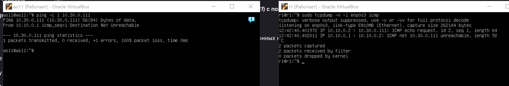
<figcaption>Запустил на r1 перехват сетевого трафика, проходящего через enp0s3, пропинговал с ws11 несуществующий IP 10.30.0.111.</figcaption>

`ws11` пингует  адрес `10.30.0.111`, `r1` не знает маршрут до `10.30.0.111` и отправляет обратно ICMP-пакет с кодом `Network Unreachable`, `ws11` получает эти пакеты и выводит сообщение об ошибке пинга.

7. Сохранил дампы образов виртуальных машин.

## Динамическая настройка IP с помощью DHCP (Part 6)
1. Для r2 настроил в файле /etc/dhcp/dhcpd.conf` конфигурацию службы DHCP
Указал адрес маршрутизатора по умолчанию, `DNS-сервер` и адрес внутренней сети.
Для этого добавил в файл `dhcpd.conf`:

Настройку подсети `10.100.0.0/16`(пустые скобочки- сервер не будет выдавать IP-адреса в этой подсети):
`subnet 10.100.0.0 netmask 255.255.0.0 {}`

Настройку подсети `10.20.0.0/26`(диапазон адресов (range)- от `10.20.0.2` до `10.20.0.50`, шлюз по умолчанию (option routers)-` 10.20.0.1`, DNS-сервер для клиентов (option domain-name-servers)- `10.20.0.1`):
`subnet 10.20.0.0 netmask 255.255.255.192`
`{`
`  range 10.20.0.2 10.20.0.50;`
`  option routers 10.20.0.1;`
`  option domain-name-servers 10.20.0.1;`
`}`

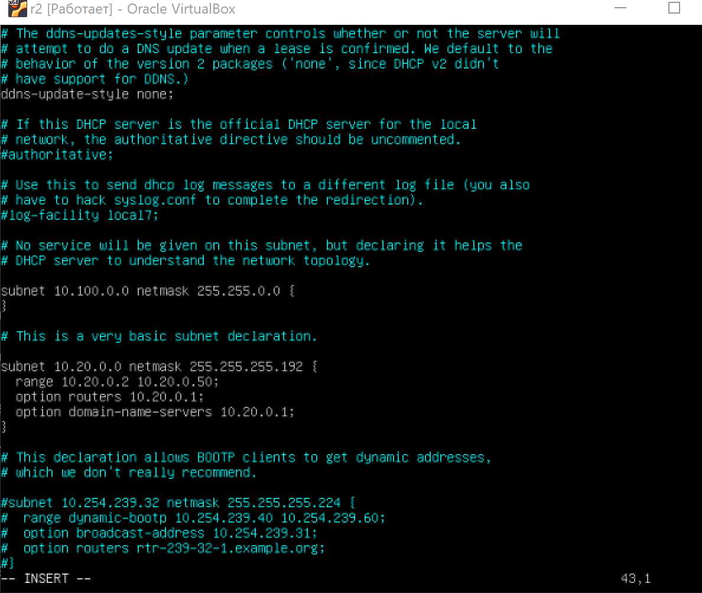
<figcaption>Измененный файл /etc/dhcp/dhcpd.conf.</figcaption>

2.  В файле /etc/resolv.conf пропиcал nameserver 8.8.8.8
Т.е. в конфигурационном файле, который используется для указания DNS-серверов, указал публичный DNS-сервер `Google Public DNS`.

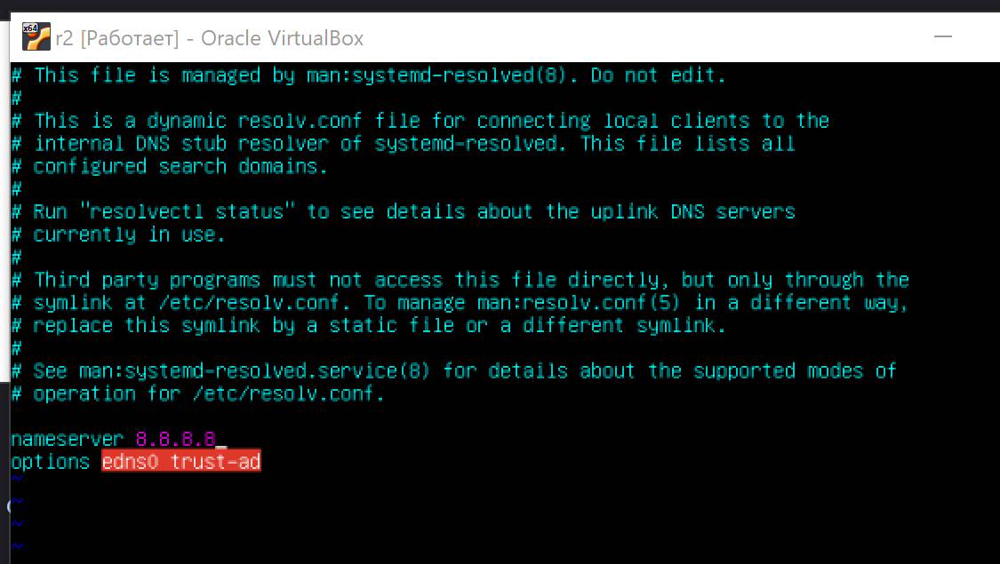
<figcaption>Измененный файл /etc/resolv.conf.</figcaption>

Перезагрузил службу DHCP командой `systemctl restart isc-dhcp-server`. Машину `ws21` перезагрузил при помощи `sudo reboot` и через `ip a` показал, что она получила адрес. Также пропинговал `ws22` с `ws21`.

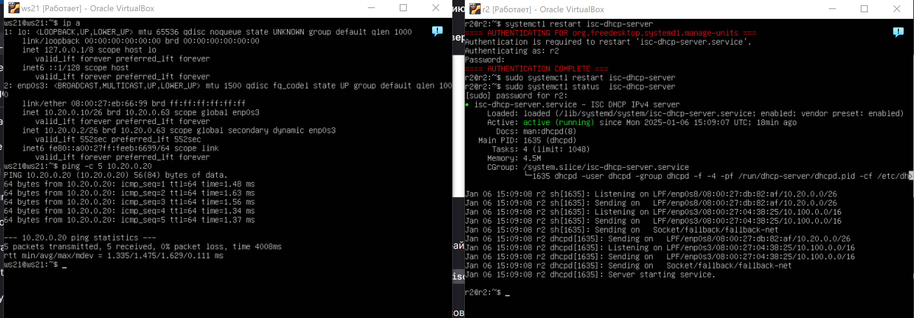
<figcaption>Перезагрузил службу DHCP и проверил, что она работает, перезагрузил ws21 и выполнил команду ip a, пропинговал ws22.</figcaption>

3. Указал `MAC-адрес` для идентификации устройств в локальной сети на канальном уровне модели OSI у `ws11`, добавил строки: `macaddress: 10:10:10:10:10:BA`, `dhcp4: true`.
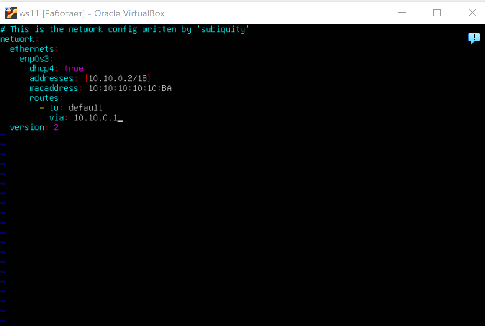
<figcaption>Измененный файл</figcaption>

4. Для r1 настроил аналогично r2, но сделал выдачу адресов с жесткой привязкой к `MAC-адресу` `ws11`. Также обновил /etc/resolv.conf прописал nameserver 8.8.8.8.
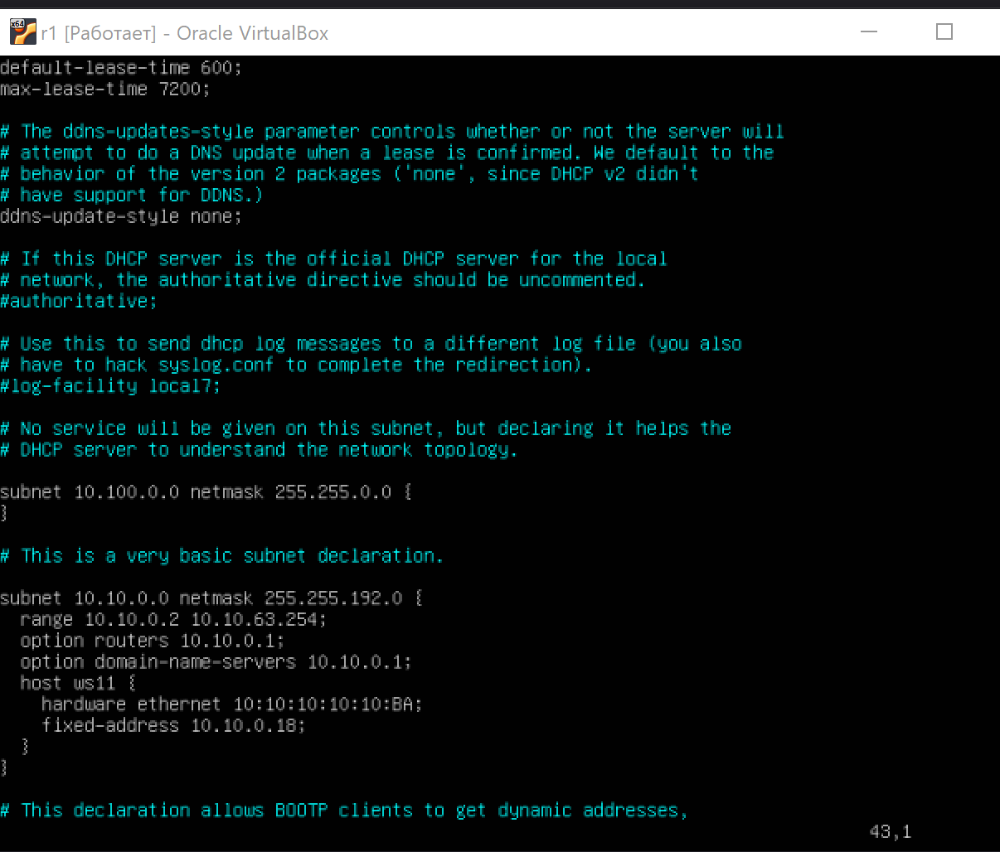
<figcaption>Измененный файл /etc/dhcp/dhcpd.conf</figcaption>

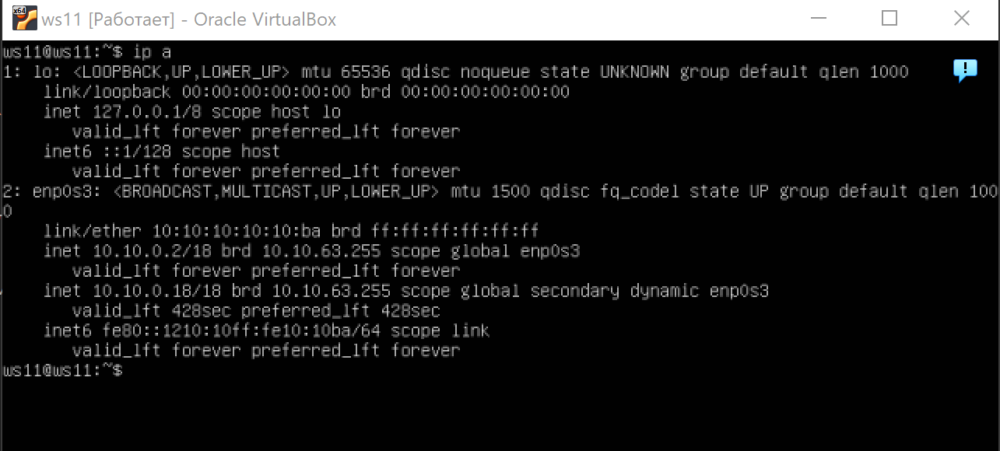
<figcaption>Перезапустил, обновил настройку MAC-адреса в виртуалбоксе и увидел, что адрес обновился.</figcaption>

5. Запросил с ws21 обновление IP-адреса.
Для этого использовал команду `sudo dhclient -r`, чтобы удалить текущий IP-адрес от DHCP.
После этого  использовал команду `sudo dhclient -v enp0s3`, чтобы получить новый IP-адрес от DHCP
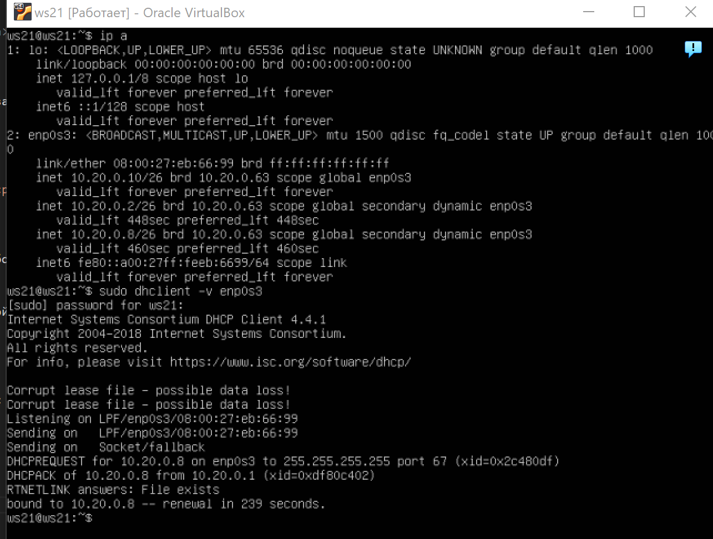
<figcaption>Скрин IP до и вызова команды для обновления. </figcaption>

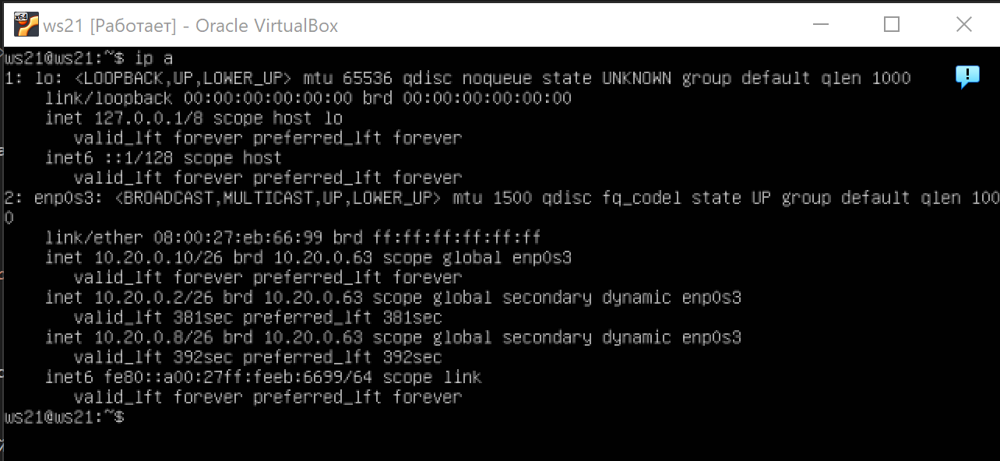
<figcaption>Скрин IP после обновления. </figcaption>

DHCP сервера пользовался в данном пункте.
`subnet`- для определения подсети.
`range`- для задания диапазона IP-адресов.
`option routers`- для указания шлюза.
`option domain-name-servers`- для указания DNS-сервера.
`dhclient`- для освобождения и обновления IP-адреса

6. Сохранил дампы образов виртуальных машин.

## NAT (Part 7)
1. В файле /etc/apache2/ports.conf на ws22 и r1 изменил строку Listen 80 на Listen 0.0.0.0:80
То есть сделал сервер Apache2 общедоступным. Apache2 нужен для того, чтобы обслуживать веб-сайты и приложения. Он обрабатывает запросы от клиентов, возвращает им веб-страницы, файлы или данные, а также поддерживает динамический контент через интеграцию с языками программирования. В двух словах: Apache2 нужен, чтобы принимать запросы, находить нужные данные и возвращать их пользователю.
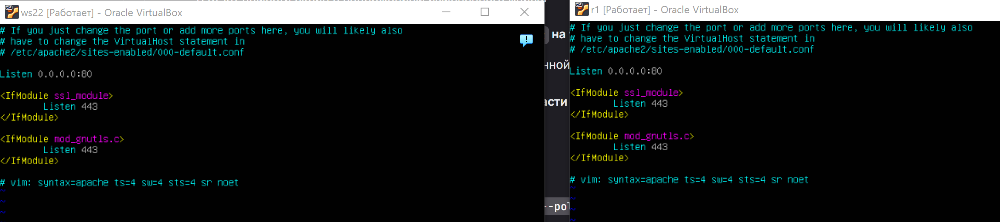
<figcaption>Т.е. теперь Apache2 слушает порт 80 не только на локальном интерфейсе (127.0.0.1),но и на всех сетевых интерфейсах машины. Т.к. Apache2 еще не запущен, не нужно перезагружать его для принятия изменений.</figcaption>

2. Запустил веб-сервер Apache
Использовал команду `service apache2 start` на `ws22` и `r1`.
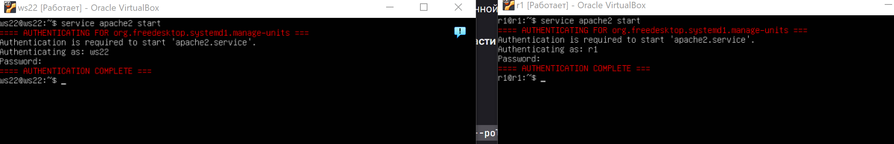
<figcaption>Запуск Apache.</figcaption>

3. Добавил в фаервол на r2
Применил следующие правила:
- Удаление правил в таблице `filter` (основная таблица для фильтрации сетевого трафика, выбирается по умолчанию) — `iptables -F`.

- Удаление правил в таблице `NAT` (отвечает за преобразование сетевых адресов, например, `DNAT`- изменение адреса назначения для входящих пакетов. `SNAT`- изменение исходного адреса для исходящих пакетов.) — `iptables -F -t nat`.

- Отбрасывание всех маршрутизируемых пакеты (все пакеты, которые должны быть перенаправлены через устройство, будут отброшены.)- `iptables --policy FORWARD DROP`.

Запустил скрипт и пропинговал соединение между `ws22` и `r1` командой. При запуске файла с этими правилами, `ws22` не должна пинговаться с `r1`.
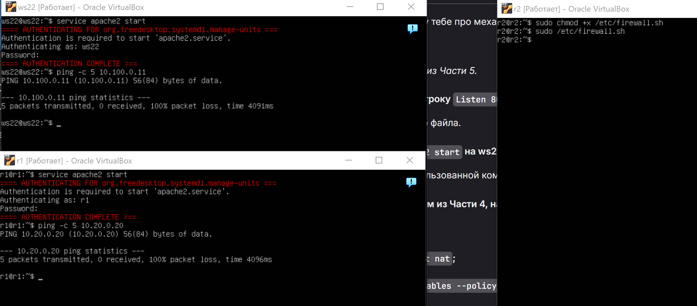
<figcaption>Запуск скрипта и попытка пропинговать.</figcaption>

4. Добавил в файл еще одно правило
- Разрешил маршрутизацию всех пакетов протокола ICMP(добавляет правило в цепочку FORWARD, которое разрешает маршрутизацию всех пакетов протокола ICMP. т.е. теперь пакеты ICMP исключаются из политики, которая была прописана в прошлом пункте, и разрешаются)- `iptables -A FORWARD -p icmp ACCEPT`.
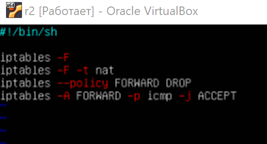
<figcaption>Измененный скрипт.</figcaption>

Запустил скрипт и пропинговал соединение между `ws22` и `r1`. При запуске файла с этими правилами, `ws22` должна пинговаться с `r1`.
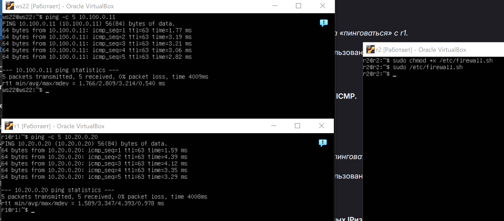
<figcaption>Запуск скрипта и пинг.</figcaption>

5. Добавил в файл еще несколько правил

- Включил `SNAT`, а именно маскирование всех локальных IP из локальной сети, находящейся за r2 (по обозначениям из Части 5 — сеть `10.20.0.0`). Т.е. все пакеты из внутренней сети (в данном случае `10.20.0.0/26`) будут выходить во внешнюю сеть с IP-адресом внешнего интерфейса маршрутизатора (в данном случае `10.100.0.12/16`)- `iptables -t nat -A POSTROUTING -o enp0s3 -s 10.20.0.0/26 -j SNAT --to-source 10.100.0.12`

В таблицу `NAT(-t nat)` добавил правило в цепочку `POSTROUTING(-A POSTROUTING )`, после маршрутизации, но перед отправкой пакета через внешний интерфейс, пакет проходит через цепочку POSTROUTING, применяются правила, которые изменяют пакет. Указываю исходную сеть, которую нужно маскировать `(-s 10.20.0.0/26)`, указываю интерфейс `r2`, через который пакеты будут проходить во внешнюю сеть `(-o enp0s3)`, указываю, что применяется SNAT `(-j SNAT)`, указывает IP-адрес, на который будет заменён исходный IP-адрес пакетов `(--to-source 10.100.0.12)`

Также добавил правило  `iptables -A FORWARD -m state --state ESTABLISHED,RELATED -j ACCEPT`,  разрешает пересылку пакетов, если они принадлежат уже установленным или связанным соединениям `(--state ESTABLISHED,RELATED)`, для этого загружается модуль state, который позволяет проверять состояние соединения пакета `(-m state)`. Т.е. без этого правила не получится получать ответ от устройств из внешней сети.

- Включил `DNAT` на `8080` порт машины `r2` и добавил к веб-серверу `Apache`, запущенному на `ws22`, доступ извне сети. Т.е. теперь запрос из внешней сети, преобразуется r2, чтобы предоставить доступ к внутреннему серверу ws22, не раскрывая его реальный IP-адрес.
Использовал `iptables -t nat -A PREROUTING -i enp0s3 -p tcp --dport 8080 -j DNAT --to-destination 10.20.0.20:80`, т.е правило применяется к пакетам, которые поступают на интерфейс enp0s3, которые используют протокол TCP и предназначены для порта 8080(альтернативный порт для HTTP-трафика, т.к. порт 80 уже занят `Apache`)
И правило `iptables -A FORWARD -p tcp --dport 80 -j ACCEPT`, оно разрешает пересылку пакетов, которые используют протокол TCP и предназначены для порта 80.

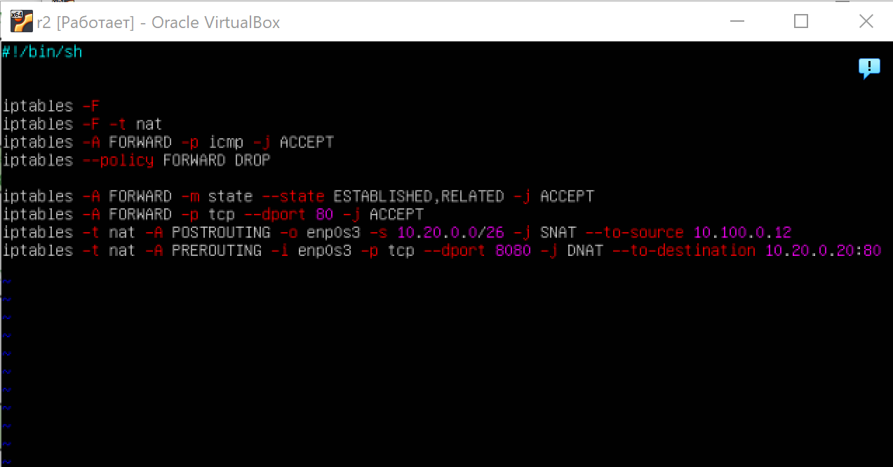
<figcaption>Измененный файл.</figcaption>

6. Проверил соединение
- По TCP для SNAT: для этого с `ws22` подключился к серверу Apache на `r1`.
telnet
- По TCP для DNAT: для этого с `r1` подключился к серверу Apache на `ws22`.
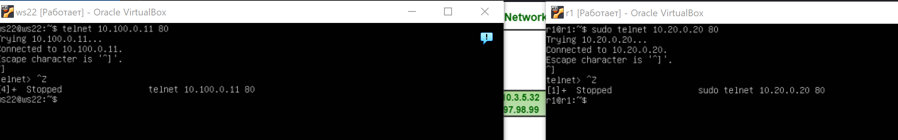
<figcaption>Проверка соединения.</figcaption>

7. Сохранил дампы.
 

## Знакомство с SSH Tunnels(Part 8)
1. Запустил фаервол из Part 7.
2. Запустил веб-сервер Apache на ws22 только на localhost (то есть в файле /etc/apache2/ports.conf изменил строку Listen 80 на Listen localhost:80).
3. Воспользовался Local TCP forwarding с ws21 до ws22, чтобы получить доступ к веб-серверу на ws22 с ws21.
Использовал команду `ssh -L 8080:127.0.0.1:80 ws22@10.20.0.20`. Т.е. локальный порт на машине `ws21` пробрасывается на удалённый порт на машине `ws22`.
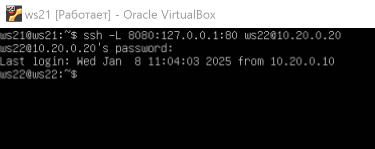
<figcaption>Выполнил команду и перешел на ws22.</figcaption>

Для проверки, сработало ли подключение, перешел во второй терминал (клавишами Alt + F2) и выполнил команду: `telnet 127.0.0.1 [локальный порт]`.
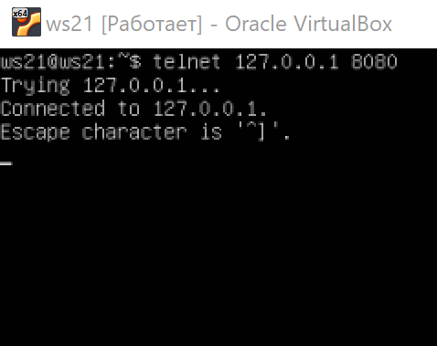
<figcaption>Проверил, что соединение прошло.</figcaption>

4. Воспользовался Remote TCP forwarding c ws11 до ws22, чтобы получить доступ к веб-серверу на ws22 с ws11.
Использовал команду `ssh -R 8080:localhost:80 ws22@10.20.0.20`, также добавил переброс на порт через `r1`. Удалённый порт на машине `ws22` пробрасывается на локальный порт на машине `ws11`.
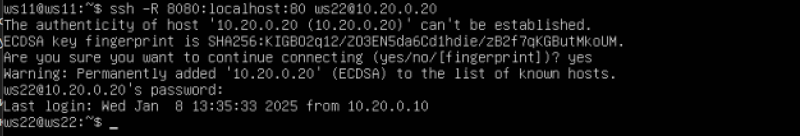
<figcaption>Выполнил команду и перешел на ws22.</figcaption>

Для проверки, сработало ли подключение, перешел во второй терминал (клавишами Alt + F2) и выполнил команду: `telnet 127.0.0.1 [локальный порт]`.
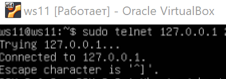
<figcaption>Проверил, что соединение прошло.</figcaption>
