## Готовый докер (Part 1)

1. **Загрузка образа Nginx**  
Взял официальный докер-образ с **nginx** и выкачал его при помощи `sudo docker pull nginx` и проверил наличие докер-образа через `sudo docker images`
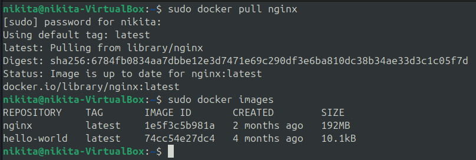
<figcaption>Выкачал докер-образ и проверил его наличие.</figcaption>

2. **Запуск контейнера**
Запустил докер-образ через `sudo docker run -d [repository]` и проверил, что образ запустился через `sudo docker ps`
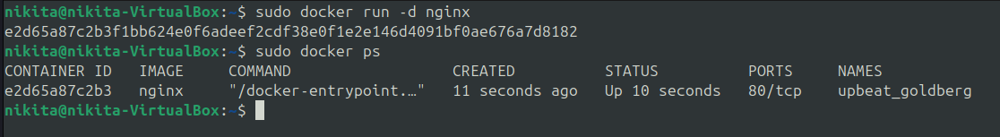
<figcaption>Запустил докер-образ и проверил, что он работает.</figcaption>

3. **Инспекция контейнера**
Посмотрел информацию о контейнере через `sudo docker inspect [container_name] -s`. Добавил флаг `-s` для отображения памяти, которую занимает контейнер.
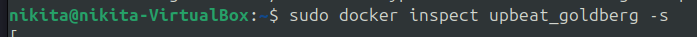
<figcaption>Вызов команды inspect.</figcaption>

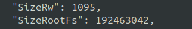
<figcaption>SizeRW- размер изменяемых данных, разница между текущим состоянием контейнера и исходным образом. SizeRootFS- общий объем памяти, который занимает контейнер (размер в байтах).</figcaption>

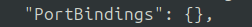
<figcaption>Замапленные порты, пусто т.к. не указывали пути при запуске контейнера.</figcaption>

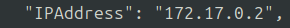
<figcaption>ip контейнера.</figcaption>

4. **Остановка контейнера** 
Остановил докер контейнер через `sudo docker stop [container_name]`и проверил, что контейнер остановился через `sudo docker ps`.
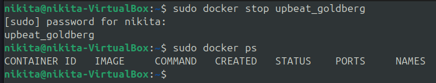
<figcaption>Остановил контейнер и проверил, что все корректно отработало.</figcaption>

5. **Запуск с пробросом портов** 
Запустил докер с портами 80 и 443 в контейнере, замапленными на такие же порты на локальной машине, через команду `sudo docker run -d -p 80:80 -p 443:443 [repository]` [repository].
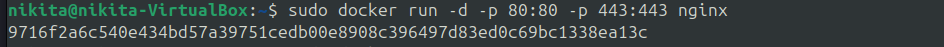
<figcaption>Запуск контейнера с маппингом портов 80:80 и 443:443.</figcaption>

6. **Проверка в браузере** 
Проверил, что в браузере по адресу *localhost:80* доступна стартовая страница **nginx**. Адрес 443 не работает, т.к. для установления https подключения требуется дополнительная настройка, которая не проводилась.
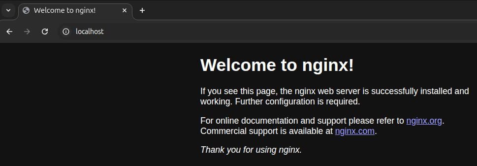
<figcaption>Стартовая страница nginx.</figcaption>

7. **Перезапуск контейнера**  
Перезапустил докер контейнер через `sudo docker restart [container_name]`. Через `sudo docker ps` проверил, что контейнер запустился.
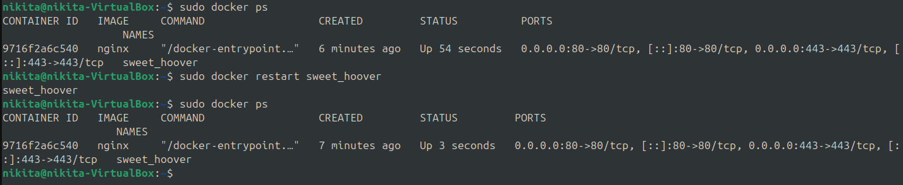
<figcaption>Вывод команды ps где видно, что процесс запущен 54 секунды назад, выполнение команды restart и повторный вывод команды ps где видно, что процесс запущен  3 секунды назад.</figcaption>

## Операции с контейнером (Part 2)

1. **Создание файл nginx.conf** 
Скопировал конфигурационный файл *nginx.conf* из докер контейнера через команду `exec`. Изучил содержимое файла
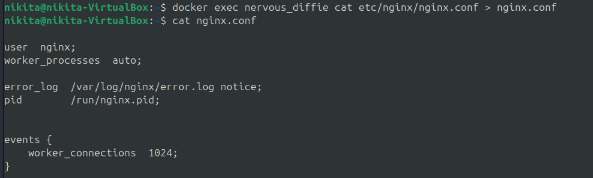
<figcaption>Копирование файла nginx.conf из докер контейнера.</figcaption>

2. **Настройка сервера**
Настроил в файле по пути */status* отдачу страницы статуса сервера **nginx**. И скопировал файл внутрь докер-образа через команду `docker cp`, перезапустил **nginx** внутри докер-образа.
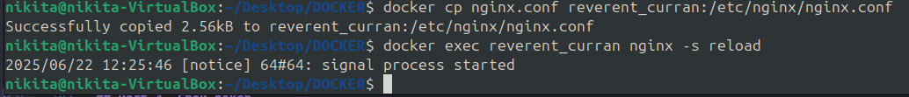
<figcaption>Копирование файла nginx.conf в докер контейнер и перезагрузка nginx внутри докер-образа.</figcaption>

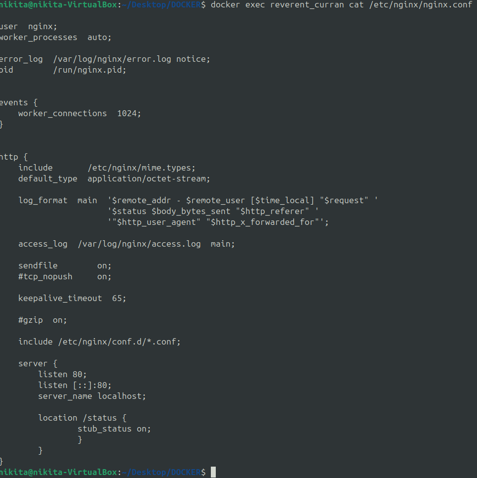
<figcaption>Внесенные в файл nginx.conf изменения.</figcaption>

3. **Страница со статусом сервера**
Проверил, что по адресу *localhost:80/status* отдается страница со статусом сервера **nginx**.
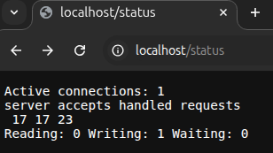
<figcaption>Вывод страницы по адресу localhost:80/status.</figcaption>

4. **Экспорт контейнера**
Экспортировал контейнер в файл *container.tar* через команду `export`, остановил контейнер.
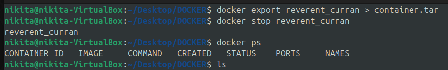
<figcaption>Экспорт контейнера и остановка контейнера и проверил, что процесс остановлен.</figcaption>

5. **Удаление остановленного контейнера**
Удали остановленный контейнер.
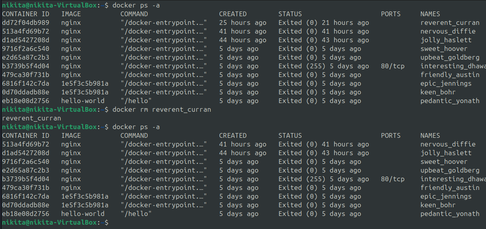
<figcaption>Просмотрел все контейнеры, в том числе и остановленные, удалил нужный контейнер и проверил, что он пропал из списка.</figcaption>

6. **Удаление образа**
Удалил образ через `docker rmi -f [image_id|repository]`.
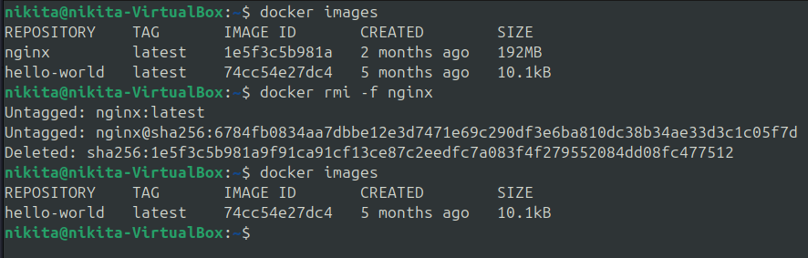
<figcaption>Просмотрел список образов, удалил нужный образ и проверил, что он пропал из списка.</figcaption>

7. **Импорт контейнера**
Импортировал контейнер обратно через команду `import`.
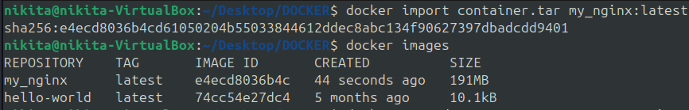
<figcaption>Импортировал контейнер и проверил, что образ появился в списке.</figcaption>

8. **Запуск импортированного контейнера**
Запустил импортированный образ и проверил, что по адресу *localhost:80/status* отдается страница со статусом сервера **nginx**.
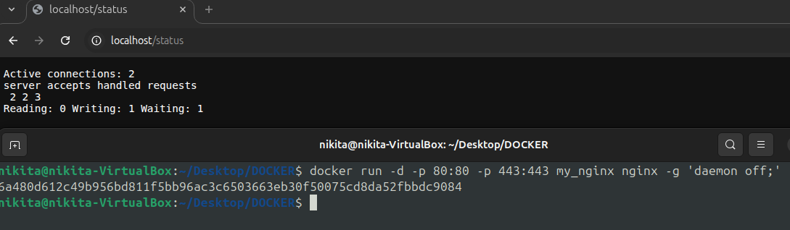
<figcaption>Запустил контейнер и проверил страницу localhost:80/status.</figcaption>

## Мини веб-сервер (Part 3)

1. Написал мини-сервер на **C** и **FastCgi**, который возвращает простейшую страницу с надписью `Hello, World!`. 
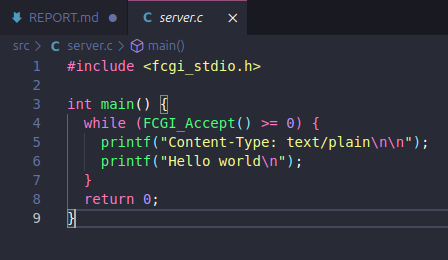
<figcaption>Содержимое файла server.с.</figcaption>

2. Скомпилировал сервер с использованием библиотеки **libfcgi**.
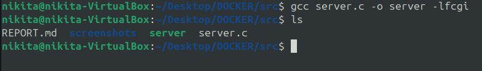
<figcaption>Компиляция.</figcaption>

3. Написал свой *nginx.conf*, который будет проксировать все запросы с 81 порта на *127.0.0.1:8080*.
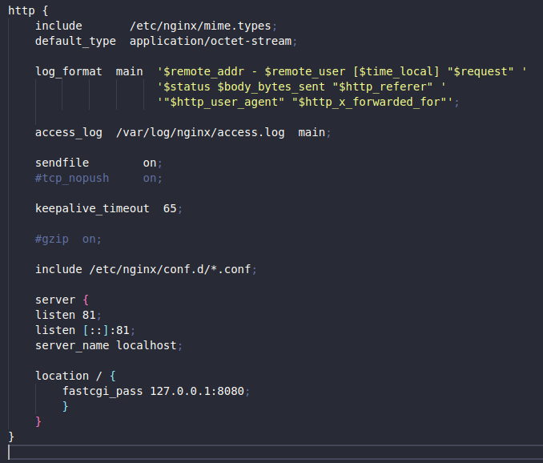
<figcaption>Содержимое файла nginx.conf.</figcaption>

4. Запустил написанный мини-сервер через *spawn-fcgi* на порту 8080. Запустил локально **nginx** с написанной конфигурацией. Проверил, что в браузере по *localhost:81* отдается написанная страничка.
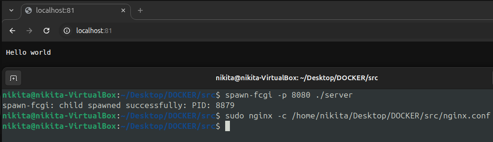
<figcaption>Запуск мини-сервера на порту 8080, запуск nginx с написанной конфигурацией и проверка страницы в браузере localhost:81.</figcaption>

## Свой докер (Part 4)

1. Написал свой докер-образ, который:
- собирает исходники мини сервера на FastCgi;
- запускает его на 8080 порту;
- копирует внутрь образа написанный *./nginx/nginx.conf*;
- запускает **nginx**.
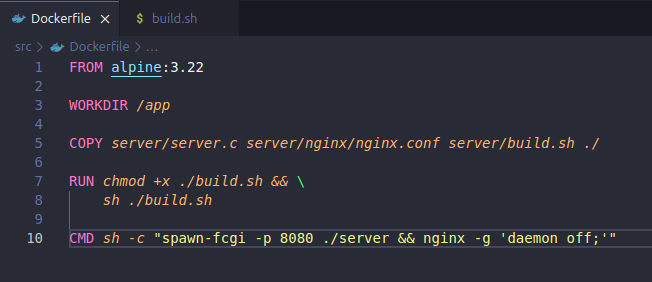
<figcaption>Написанный Dockerfile.</figcaption>

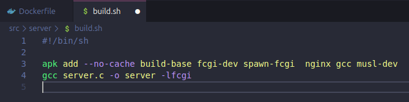
<figcaption>Написанный скрипт.</figcaption>

2. Собрал написанный докер-образ через `docker build` при этом указав имя и тег. Проверил через `docker images`, что все собралось корректно. Запустил собранный докер-образ с маппингом 81 порта на 80 на локальной машине и маппингом папки *./nginx* внутрь контейнера по адресу, где лежат конфигурационные файлы **nginx**. Проверил, что по localhost:80 доступна страничка написанного мини сервера.
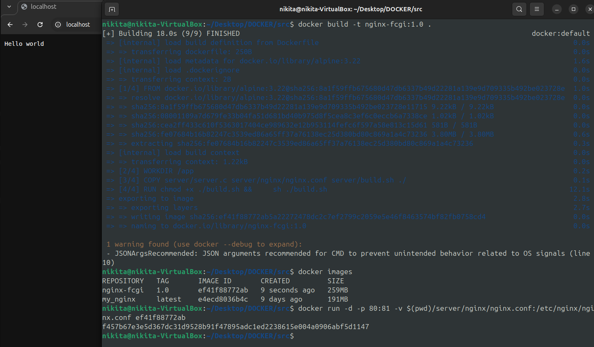
<figcaption>Собрал докер-образ, проверил корректность и запустил его. Проверил что доступна страница написанного мини сервера.</figcaption>

3. Дописал в *./nginx/nginx.conf* проксирование странички */status*, по которой надо отдавать статус сервера **nginx**.
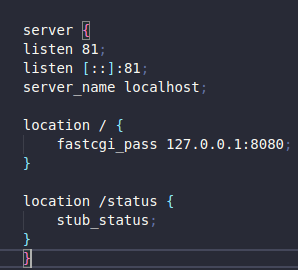
<figcaption>Измененный файл nginx.conf.</figcaption>

4. Пересобрал докер-образ. Проверил, что теперь по *localhost:80/status* отдается страница со статусом **nginx**. Проверил, что конфигурационный файл внутри докер-образа обновился самостоятельно без лишних действий.
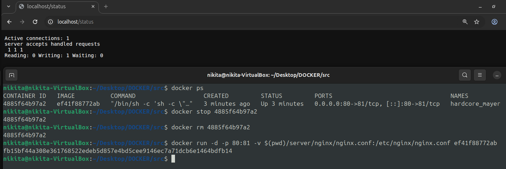
<figcaption>Перезапуск докер-образа и вывод страницы localhost:80/status.</figcaption>

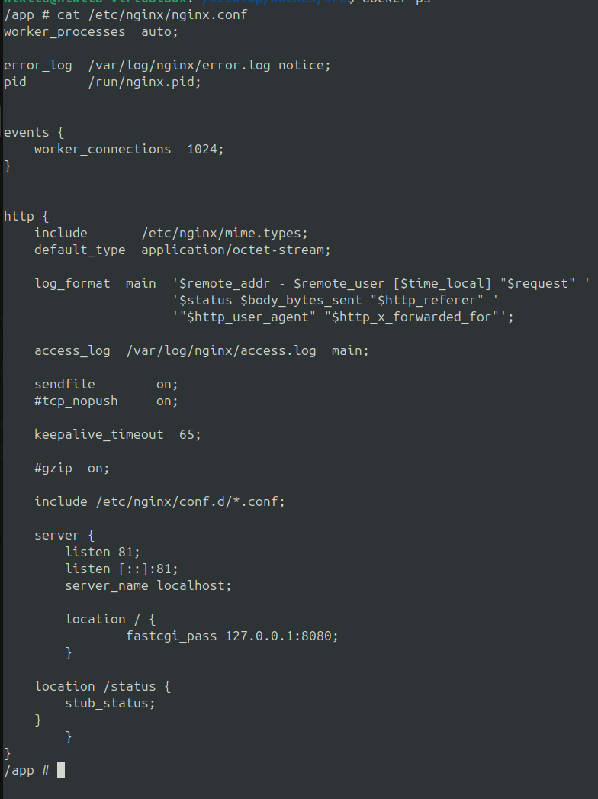
<figcaption>Проверка, что конфигурационный файл внутри докер-образа обновился.</figcaption>

## Dockle (Part 5)

1. Просканировал образ из предыдущего задания через `dockle [image_id|repository]`.
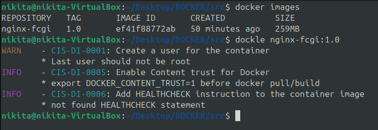
<figcaption>Отчет dockle.</figcaption>

2. Исправил образ так, чтобы при проверке через **dockle** не было ошибок и предупреждений.
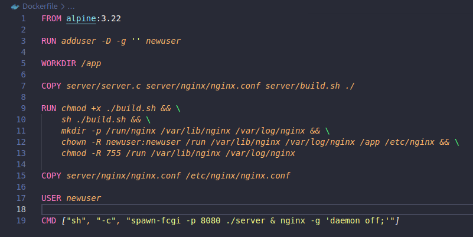
<figcaption>Исправленный образ.</figcaption>

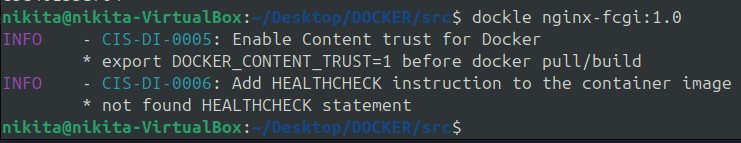
<figcaption>Новый отчет dockle.</figcaption>

## Базовый Docker Compose (Part 6)

1. Напиcал файл docker-compose.yml.
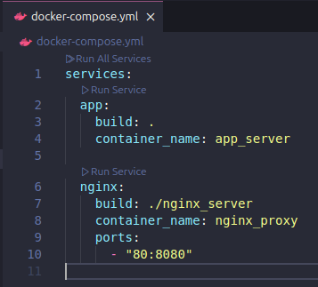
<figcaption>Файл docker-compose.yml.</figcaption>

2. Поднял докер-контейнер из Части 5 (он работает в локальной сети), поднял докер-контейнер с *nginx*, который будет проксировать все запросы с 8080 порта на 81 порт первого контейнера. Замапил 8080 порт второго контейнера на 80 порт локальной машины.
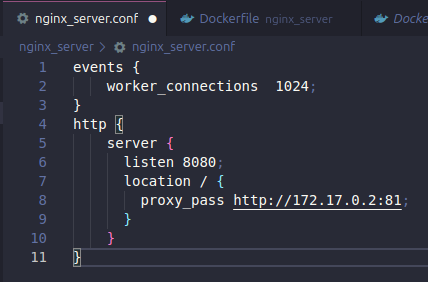
<figcaption>Конфигурационный файл для нового контейнера с nginx.</figcaption>

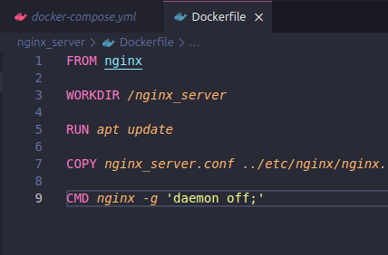
<figcaption>Dockerfile для запуска нового контейнера с nginx.</figcaption>

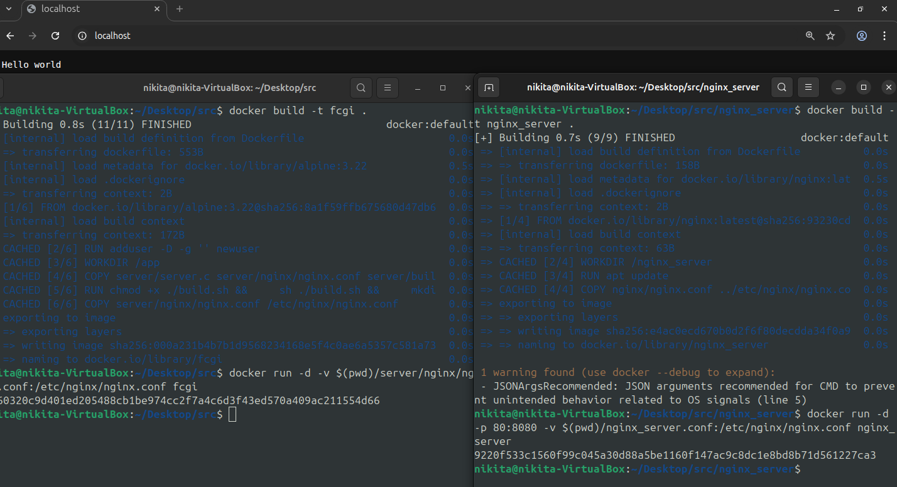
<figcaption>Запустил два контейнера, замапил порты и проверил, что корректно отдает страничку.</figcaption>

3. Остановил все запущенные контейнеры.

4. Собрал и запустил проект с помощью команд `docker-compose build` и `docker-compose up.` Проверил, что в браузере по *localhost:80* отдается написанная страничка, как и ранее.
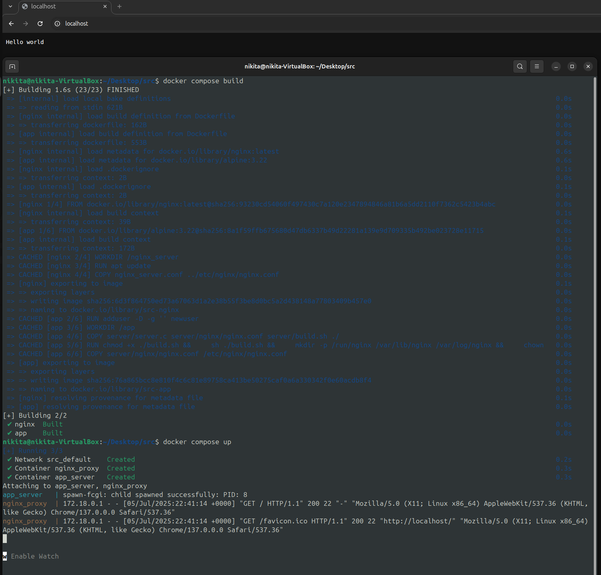
<figcaption>Сборка и запуск проекта, страница с корректным выводом.</figcaption>